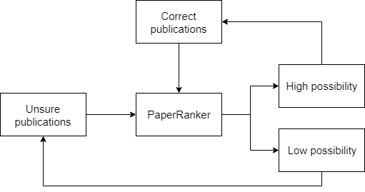

# Paper Ranker

## Introduction

There are some professors that have the same name. In this case, we have difficulties in distinguishing whether a publication is long to a professor. PaperRanker is a class which is used to predict how much possibility there is that a publication is belong to a professor.



Our idea is that we can use some correct publications and coauthor relationship to solve this problem. If a correct coauthor relationship exists in an unsure publication, the possibility that this publication is belong to that professor is much higher.

## Definition

```python
def __init__(self, use_clf=False)
```

Based on the idea that a professor's interest won't change too much, we also try to use [NSFC Subject Classifier](https://github.com/AMinerOpen/prediction_api/blob/master/doc/NSFC_Subject_Classifier.md) to help us to predict. If you want to use it, you should set `use_clf=True`. 

## Method

### label

```python
def label(self, correct_pubs, unsure_pubs, threshold=0.5, trans=youdao_translate)
```

#### Introduction

Use iterative algorithm to predict how much possibility there is that a publication is belong to a professor.

#### Paramters

##### correct_pubs

 A list of this professor's publications. This is a list of dictionaries. And the dictionary should have following fields.

|  name   |        Introdcution         |
| :-----: | :-------------------------: |
|  title  | `string`, publication title |
| authors | A list of `string`, authors |
|  year   | `integer`, publication year |

For example:

```python
{
    "title": "Study of quantitative elastography with supersonic shear imaging in the diagnosis of breast tumours",
    "year": 2013,
    "authors": [
        "Zhili Wang",
        "Junlai Li",
        "Min Li",
        "Yan Huang",
        "WenBo Wan",
        "Jie Tang"
    ]
}
```

##### unsure_pubs

 A list of unsure publications. The format is similar to `correct_pubs`

##### threshold

If the possibility of a publication is smaller than this threshold, it won't consider as a correct publication.

##### trans

In fact, the classifier can only work on **Chinese** words because of the classification standard and the training data. In order to handle publications in other languages, you need to provide a translation function.  It should be able to translate a list of **strings** in another language to Chinese.

In default, we provide a translator based on [youdao api](http://fanyi.youdao.com/).  But you cannot use this translator too often because it is only a free version. 

#### Return value

`(a,b)`, two list of unsure publications and their possibilities. The first one has high possibilities, and the second one has low possibilities.

### ranking

```python
def ranking(self, correct_pubs, unsure_pubs, threshold=0.5, trans=youdao_translate)
```

#### Introduction

Predict how much possibility there is that a publication is belong to a professor. The algorithm will be used just for one time.

#### Parameters

#### Return value

Similar to `label`

## Test

The experiment is based on the publications from [Jie Tang  (唐杰)](http://www.aminer.cn/profile/jie-tang/53f46a3edabfaee43ed05f08) and [Jie Tang  (唐捷)](http://www.aminer.cn/profile/jie-tang/542edff0dabfae498ae3c756) .

I use [baidu translation](http://api.fanyi.baidu.com/api/trans/product/index) as the translator and set `threshold = 0.5`

| Precision Rate | Recall Rate | F1 Score |
| :------------: | :---------: | :------: |
|     0.960      |    0.705    |  0.813   |